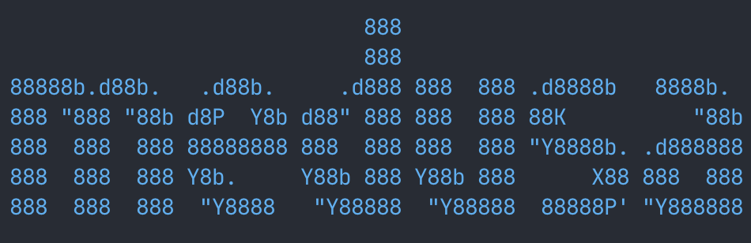

<p align="center">
  
</p>

<p align="center">TUI for easily running parallel coding agents</p>

<p align="center">
  <a href="https://github.com/Skowt/medusa/releases"></a>
  <a href="LICENSE"></a>
</p>

<p align="center">
  <a href="#quick-start">Quick start</a> ·
  <a href="#how-it-works">How it works</a> ·
  <a href="#features">Features</a> ·
  <a href="#configuration">Configuration</a> ·
  <a href="#development">Development</a> ·
  <a href="#credits">Credits</a>
</p>

## What is Medusa?

Medusa is a terminal UI for [Claude Code](https://claude.com/claude-code). Run multiple agents in parallel — each in its own git worktree on its own branch — and use the monitor view to see which agents are working, idle, or waiting on your input, so you can juggle several tasks at once without losing track of what needs attention.

## Prerequisites

- [tmux](https://github.com/tmux/tmux) 3.2 or newer — each agent runs in its own tmux session for terminal isolation and persistence.
- macOS or Linux. Windows is not supported.
- Go 1.24 or newer — only if building from source.

## Quick start

Install with the shell script:

```bash
curl -fsSL https://raw.githubusercontent.com/Skowt/medusa/main/install.sh | sh
```

This installs into `~/.local/bin` and never asks for a password, so it works on
machines where you don't have admin rights. Point it somewhere else with
`INSTALL_DIR`:

```bash
curl -fsSL https://raw.githubusercontent.com/Skowt/medusa/main/install.sh | INSTALL_DIR="$HOME/bin" sh
```

Then run it:

```bash
medusa
```

Verify the install:

```bash
medusa --version
```

## Updating

Medusa checks for updates in the background on startup. When one is available you'll see a toast notification; open the Settings dialog to install it in place.

To update manually, re-run the install script:

```bash
curl -fsSL https://raw.githubusercontent.com/Skowt/medusa/main/install.sh | sh
```

## How it works

Each worktree tracks a repo checkout and its metadata. For local workflows, worktrees are typically backed by git worktrees on their own branches so agents work in isolation and you can merge changes back when done.

## Features

- **Parallel agents**: Launch multiple agents within main repo and within worktrees
- **No wrappers**: Works with Claude Code
- **Keyboard + mouse**: Can be operated with just the keyboard or with a mouse
- **All-in-one tool**: Run agents, view diffs, and access terminal

## Workspace Scripts

You can configure setup and run scripts per repository by creating a `.medusa/workspaces.json` file in your repo root.

### Configuration

```json
{
  "setup-workspace": [
    "uv venv && uv sync",
    "cd client && npm i"
  ],
  "run": [
    {"name": "backend", "command": "python server.py"},
    {"name": "frontend", "command": "cd client && npm start"}
  ],
  "archive": "echo done"
}
```

| Field | Type | Description |
|---|---|---|
| `setup-workspace` | `string[]` | Commands run sequentially when a workspace is created |
| `run` | `string` or `object[]` | Dev server commands — one visible tab per entry. Launched automatically once `setup-workspace` finishes, or manually via Ctrl-a r |
| `archive` | `string` | Command run when archiving a workspace |

The `run` field supports two formats:
- **String**: `"run": "npm start"` — opens a single "dev server" tab
- **Array**: `"run": [{"name": "...", "command": "..."}]` — opens a named tab per entry

### Environment Variables

The following variables are injected into all script environments:

| Variable | Example | Description |
|---|---|---|
| `WORKSPACE_PORT` | `6200` | Base port allocated for this workspace |
| `WORKSPACE_PORT_RANGE` | `6200-6209` | Full port range (10 ports per workspace) |
| `MEDUSA_WORKSPACE_NAME` | `my-feature` | Workspace name |
| `MEDUSA_WORKSPACE_ROOT` | `/path/to/worktree` | Worktree root directory |
| `MEDUSA_WORKSPACE_BRANCH` | `my-feature` | Git branch name |
| `ROOT_WORKSPACE_PATH` | `/path/to/source/repo` | Source repository path |

Each workspace gets a unique port range starting from 6200 (configurable), incremented by 10 per workspace. Use `WORKSPACE_PORT` in your scripts to avoid port collisions when running multiple workspaces simultaneously.

### When run commands fire

Run commands fire once, automatically, as soon as `setup-workspace` finishes for a newly created workspace — each entry opens in its own visible tab. They're independent of agent tabs: setup-complete and agent-tab creation aren't ordered relative to each other, and a workspace can have any mix of agent tabs and script tabs (or none).

Press **Ctrl-a r** at any time to relaunch the run scripts for the active workspace. This closes existing script tabs first (killing their tmux sessions) and starts fresh ones — also the way to pick up edits to `workspaces.json`.

### Notes

Each command runs from the workspace's primary worktree root; failures in `setup-workspace` abort workspace setup. Workspace metadata (not to be confused with the per-repo config file above) is tracked in `~/.medusa/workspaces.json`.

## Development

Build and run from source:

```bash
git clone https://github.com/Skowt/medusa.git
cd medusa
make run
```

Or install directly with Go:

```bash
go install github.com/Skowt/medusa/cmd/medusa@latest
```

### Cutting a release

Releases are cut manually from a clean `main` checkout. A release is only triggered by pushing a `v*`-prefixed tag — nothing auto-releases on merge.

```bash
make release VERSION=vX.Y.Z
```

That target runs `release-check` (tests + harness smoke), `release-tag` (annotated local tag), and `release-push` (`git push origin vX.Y.Z`). The pushed tag triggers `.github/workflows/release.yml`, which runs GoReleaser and publishes darwin/linux × amd64/arm64 archives plus a `checksums.txt` to the GitHub releases page.

If the workflow run fails for a transient reason, re-trigger it without re-tagging: GitHub → Actions → Release → **Run workflow**, and enter the existing tag. Bump the patch version only if you need to ship different code.

The full commit conventions and release walkthrough live in `.claude/skills/medusa-commits-and-releases/SKILL.md`.

## Credits

Medusa was heavily inspired by [amux](https://github.com/andyrewlee/amux) by [@andyrewlee](https://github.com/andyrewlee). Thank you for the original design and the code Medusa builds on.

## Uninstalling

The install script puts medusa in `~/.local/bin` by default. To remove it and its two helper binaries:

```bash
rm -f ~/.local/bin/medusa ~/.local/bin/medusa-approve-compound ~/.local/bin/medusa-hook-emit
```

If you installed somewhere else, `command -v medusa` will tell you where.

State is kept under `~/.medusa/` (workspace registry, logs, workspace metadata). Remove it too if you want a clean slate.
